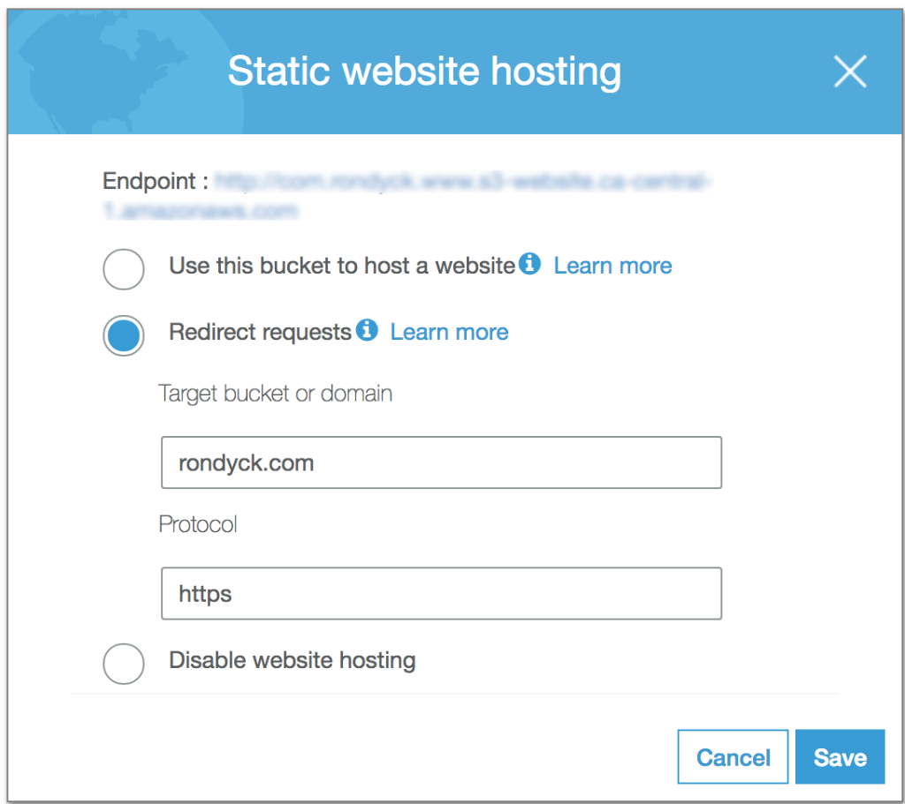
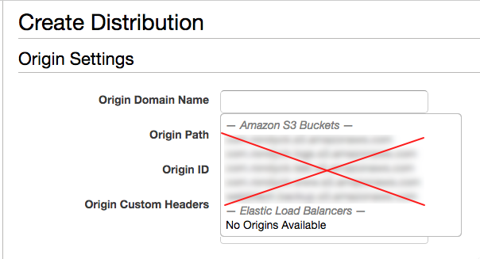
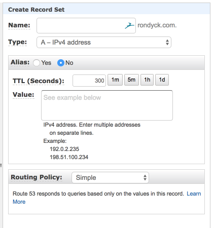
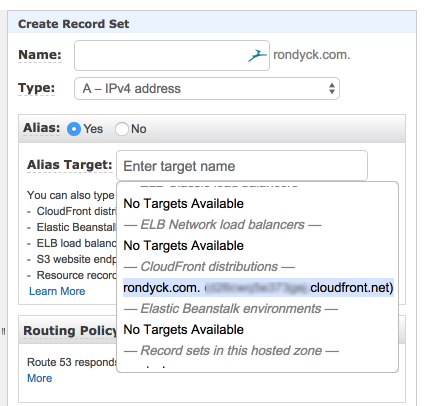
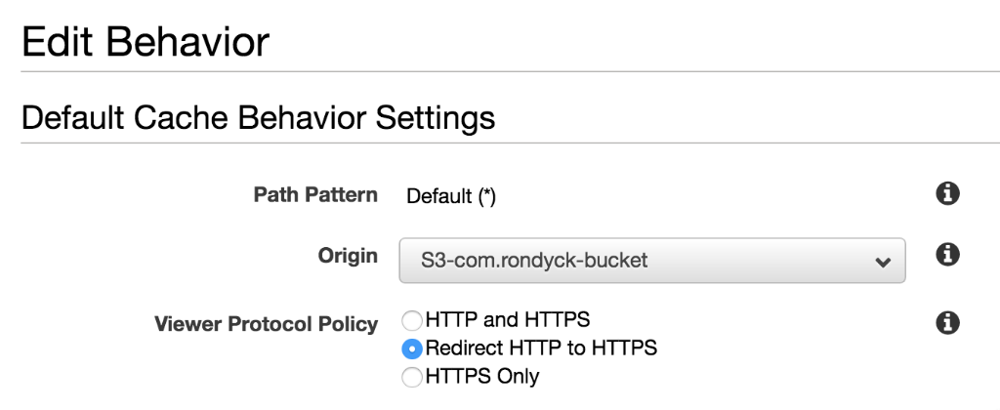
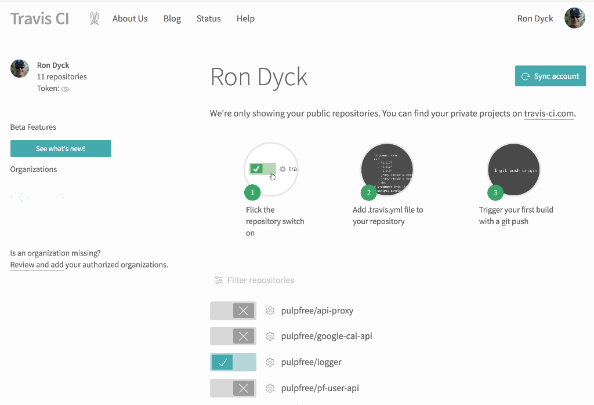

Although there are a number of very good posts related to building, deploying and hosting a [Gatsby](https://www.gatsbyjs.org/) site, I wanted to share my personal experiences in hopes that it would make the process a little smoother for other Gatsby developers looking for an inexpensive (free) way to host their site.

The **repository** for this project is available at: [github.com/pulpfree/rondyck](https://github.com/pulpfree/rondyck)

>**A note to Windows users:**  
*I'm using a UNIX based OS (OS X), so be aware that a few CLI commands and utilities used in this post may not work the same. My apologies ahead of time for any inconvenience.*

Before starting, I'd like to cover a few objectives I had in mind for this project:  
 - Keep the site build simple and maintain extensibility
 - Utilize any AWS services where applicable
 - Deploy with Travis CI

 Ok so let's get started.

## Gatsby Build
I wanted a static site builder to create a new personal site for myself. In looking for an alternative to [Jekyll](https://jekyllrb.com/) or [Hugo](https://gohugo.io/) I discovered [Gatsby](https://www.gatsbyjs.org/). Gatsby is a modern framework that really rocks! It utilizes many popular web technologies including: [React.js](https://reactjs.org/), [Webpack](https://webpack.js.org/) and [Graphql](http://graphql.org/) -  the very same technologies I use on a regular basis.

To get started you'll need to have [npm](https://www.npmjs.com/get-npm) installed. Then install the Gatsby command line tool with:  
```bash
npm install -g gatsby-cli
```

Gatsby and its community provide a variety of [starter kits](https://www.gatsbyjs.org/docs/gatsby-starters/). And they're as simple to use as:  
```bash
gatsby new [SITE_DIRECTORY] [URL_OF_STARTER_GITHUB_REPO]
```
After reading through the [Gatbsy tutorial](https://www.gatsbyjs.org/tutorial/), I decided to start with the most basic of starter sites. To do so simply type:  
```bash
gatsby new [SITE_DIRECTORY]
```
Then cd into the new directory and start the server:  
```bash
cd [SITE_DIRECTORY] && gatsby develop
```  
Open your browser to `localhost:8000` and voila, your site is up and running.

Depending on the starter kit you choose, things can be a little different from here on in, and so I will leave the development aspect to the reader. There are a number of good tutorials available and I really do recommend that you read the entire [Gatbsy tutorial](https://www.gatsbyjs.org/tutorial/)as you'll gain a much better understanding of how things work, in particular [working with data and GraphQL queries](https://www.gatsbyjs.org/tutorial/part-four/#our-first-graphql-query). Understanding the basics of GraphQL is important as it's one of the special features that makes Gatsby so cool.

## AWS Services
For this tutorial, we'll be using the following AWS services, however, don't feel that you have to use all of them, only S3 is required to host your Gatsby site, albeit somewhat feature limited.
- [S3](https://aws.amazon.com/getting-started/projects/host-static-website/)
- [CloudFront](https://aws.amazon.com/CloudFront/)
- [Route53](https://aws.amazon.com/route53/)

To start with you'll need an AWS account, and if you don't have one, then head over to [aws.amazon.com](https://aws.amazon.com/) and create one. They have a large offering of [free stuff](https://aws.amazon.com/free/) and with the exception of Route53, everything required in this tutorial is covered in their free tier.

To accommodate a domain redirect from a www subdomain to your root domain, we will need to duplicate a number of our resources including:
- 2 S3 static hosted website buckets
- 2 CloudFront distributions
- 2 Route53 address records

> **A Note on Handling www Redirects**  
> I prefer to not use "www" as a sub-domain, IMHO it's redundant. Some prefer to have the root domain redirected to their www sub-domain, either way, you'll need to handle this redirect differently than in a typical Apache or Nginx server set-up when using S3 for hosting.

### AWS S3 Set-up
As mentioned we'll need to create 2 buckets. A bucket to store our static site files for our **"root domain"**, and a "redirect" bucket to redirect the "www" subdomain to the root domain which I'll refer to as the **"redirect domain"**. 

Bucket names have to be unique and I prefer to use the [reverse domain name notation](https://en.wikipedia.org/wiki/Reverse_domain_name_notation) format primarily because it helps with organization and sorting. Feel free to do whatever makes sense to you. Here are the 4 steps in creating a bucket:  
1. Name and region
2. Set properties
3. Set permissions
4. Review

Enter your name and region for step #1 and leave default values for the remaining steps. Create both the root domain and the www redirect buckets. With that complete, we'll need to make some configuration changes.

**Root domain bucket**  
Select your bucket from the list by clicking on the name itself. On the top of the screen, you'll see a tabbed menu, we want the `Permissions` tab. Click the `Bucket Policy` button. Here you're presented with the `Bucket policy editor` where you can enter JSON policy similar to below, replacing `com.my-domain` in the `Resource` line with your bucket name.

```json
{
    "Version": "2012-10-17",
    "Statement": [
        {
            "Sid": "AddPerm",
            "Effect": "Allow",
            "Principal": "*",
            "Action": "s3:GetObject",
            "Resource": "arn:aws:s3:::com.my-domain/*"
        }
    ]
}
```
 After saving you'll notice a warning about *public access* which you can safely ignore. The `Action` we used is `s3:GetObject`, a "GET" only action - which is a read-only permission and required for our application. Had we used a wildcard access like `s3:*`, we certainly would have exposed ourselves to risk.
 
 Next click on the `Properties` tab, then the `Static website hosting` tab. Click the `Use this bucket to host a website` radio button and enter `index.html` for both the `Index` and `Error` document fields and then click `Save`. Since Gatsby does a good job of handling 404 missing documents, I find that using the default index.html document good for handling our error documents. Now if you click the `Static website hosting` box in the `Properties` tab, you'll see an `Endpoint` link at the top. Make a mental note of this link location as we'll be using this later on.
 
 **Redirect domain bucket**  
 Now do the same for our "redirect bucket" with a few exceptions. For the `Bucket Policy`, enter your redirect domain name; example: `"Resource": "arn:aws:s3:::com.my-domain.www/*"`. Then when you get to the `Static website hosting` tab, select the `Redirect requests` radio button. Enter your "root domain" in the `Target bucket or domain` field, and `https` into the `Protocol` field. These settings will take affect once the CloudFront and DNS set-up is complete. Here is how it looks for my domain:
 

Now you can upload your Gatsby site files into your bucket. Go to your Gatsby site directory in your terminal and enter: `gatsby build`. When complete all required site files will be available in the `public` directory. Upload the contents of the `public` directory to the root of your "root domain" bucket. 

Let's test our the "root domain" bucket with the `Endpoint` link.  Click on the link and you should see your Gatsby site in your default browser. If you don't, go back and re-trace your steps to see if you made any errors. We'll test the "redirect domain" once we have both the `CloudFront` and the `Route53` set-up completed. 

With the S3 bucket creation and configuration out of the way, let's move on to the CloudFront set-up.

### AWS CloudFront Set-up
The AWS CloudFront service is a global content delivery network service and essentially makes your site a lot snappier for visitors outside of your S3 bucket location - your cross-continent visitors will thank you!

**Root Domain Distribution**  
Head over to the `CloudFront` section of AWS. Click `Create Distribution` and under `Web` click `Get Started`. Here you'll notice a fairly lengthy form with a number of options, we're only interested in a few of them.  In the `Origin Domain Name`, you'll notice a drop-down that appears when entering the field. **Do not** select any of these buckets. 

You want to enter the `Endpoint` from the "root domain" bucket we just used to test the S3 bucket. This is an important distinction and critical that we get right. Simply enter the entire endpoint URL, the `http` protocol will automatically get stripped by the form.

Next, enter your "root domain" in the `Alternate Domain Names` box, then scroll down to the comment field, and again, enter your "root domain" name. Scroll to the bottom and click the `Create Distribution` button. 

To test our distribution we'll need the `Domain Name` of our newly created distribution. Click on the `ID` of your distribution (from the distribution listing) and look for the `Domain Name` value. Copy this value, enter it into your browser, and you should see your Gatsby site. Again if you do not, retrace your steps to see where you may have erred.

**Redirect Domain Distribution**  
Repeat the previous steps to create our "redirect domain" distribution, replacing the "root domain" with your "redirect domain" values. Now when you test the "domain name" of the "redirect domain distribution" you should be redirected to your "S3 bucket root domain endpoint".

We'll be making other edits to this distribution later on but first, we need to create the necessary DNS entries. 

### AWS Route53 Set-up
I'm using the AWS Route53 service for the domain, but if you're using a different service some details will be slightly different though the essentials are the same. I won't go through the various steps in registering or transferring a domain and will assume that's already taken care of. You should have your domain listed in the Route53 *Hosted zones* section of AWS Route53.

Click on your domain to view the existing record sets. You should have an `NS` and an `SOA` record listed. Click on the `Create Record Set` button as we are going create an "A record" and alias it to our CloudFront distribution. You'll see a form that looks something like:

Select `Yes` in the `Alias` field, then put your cursor in the `Alias Target` field and you should see your CloudFront distributions listed, providing your CloudFront `Alternate Domain Name` matches your record domain name.
  

If you do not see your distribution listed, go back to the CloudFront service console and copy the distribution's `Domain Name` and enter it into the `Alias Target` field.

After your DNS entries have had a chance to propagate, test both your "root domain" and the associated CloudFront distribution `Domain Name` using the UNIX "nslookup" tool or a windows equivalent. In the results, you should see the same addresses in the "root domain" as the `Domain Name`. My testing has shown the `Domain Name` has additional addresses, but none the less it's proof that your DNS entry is resolving to your distribution.

### Adding Custom SSL Certificates
CloudFront provides custom SSL Certificate creation via the Amazon Certificate Manager (and yup it's free). With certs on both of our domains, we can forward protocol requests easily in our distribution settings.  Go to your "root domain" distribution and click the `Edit` button. In the `SSL Certificate` section click the `Custom SSL Certificate` radio button. Then click the `Request or Import a Certificate with ACM`. "ACM" is AWS's certificate manager. Enter both your "root" and "redirect" domains as names to the certificate, then follow the remaining steps to get your certificate. 

Once your certificate is ready, return to edit each of your "root" and "redirect" distributions. Then under the `SSL Certificate` section select the certificate you just created and click the `Yes, Edit` button to save the settings.

Next, we need to change the "Behavior" of our distributions so that we can forward our "HTTP" requests to the "HTTPS" protocol. For each domain, go to the `Behaviors` tab where you should see a single row where `Default (*)` is the `Path Pattern`. Select this row and then click the `Edit` button above the listing. Find the `Viewer Protocol Policy` section and select the `Redirect HTTP to HTTPS` radio button, then click the `Yes, Edit` button to save the settings. Below is an example of what you can expect to see:


> **So Why do we need SSL?**  
> Truth is we don't, it's just better. Even if you are not passing sensitive information between your site and your users, there is an SEO benefit. Here's an article titled [Is HTTPS Good for SEO?](https://www.bluecorona.com/blog/https-and-seo) that you may want to read if you're interested in learning more about the benefits.

#### Tip: *cURL* is your friend
I ran into some configuration issues when setting up CloudFront, (primarily due to just getting ahead of myself) and using [curl](https://curl.haxx.se/) was invaluable. I'm guessing that when testing with a browser CloudFront is caching not only my site files but also other settings in S3 like the `Static website hosting Redirect requests` settings. Using curl appeared to avoid these cache values and I didn't have to wait for the "CloudFront TTL's" to expire.

## Travis CI Deployment
Travis-CI is a continuous integration delivery platform available for both [enterprise](https://travis-ci.com/) and [open source](https://travis-ci.org/) (free) applications. Using Travis isn't required to deploy your site as there are a number of ways to upload your content. Feel free to skip this step if you're more comfortable with a different deployment method.

We'll be using the free version of Travis which works on any public GitHub repository. I'm really only covering the basics as far as deploying with Travis is concerned, so you may want to do a little [reading here](https://docs.travis-ci.com/) to get more familiar with Travis.

To get started you simply sign up to [Travis](https://travis-ci.org/) using your GitHub account credentials. The next step is to check off which repo's you want Travis to build. In my case the screen looks like this:


The next step is to create the Travis config file.  You'll need an AWS key pair from the same account used to manage your S3 buckets, or provision another account using AWS IAM. In your project root directory create a YAML file named `.travis.yml` that looks similar to this:

```yaml
language: node_js
node_js:
  - "9"
cache: yarn
script:
  - gatsby build
deploy:
  provider: s3
  bucket: [ROOT_DOMAIN_BUCKET]
  region: [AWS_REGION]
  skip_cleanup: true
  local_dir: public
  access_key_id:
    secure: aRLN609h0...=
  secret_access_key:
    secure: bNgVJUTwx...=
```
Be sure to replace the bucket and region with your bucket values. Also notice the  `access_key_id` and `secret_access_key` `secure` values. We need to provide AWS `ACCESS_KEY_ID` and `SECRET_ACCESS_KEY` values so that Travis can upload files to your bucket. Travis provides a CLI utility that's pretty simple to use, and you can find information on the install [here](https://docs.travis-ci.com/user/encryption-keys/). Once you've installed the utility it's as simple as:
```bash
travis encrypt --add deploy.access_key_id
```
The utility will respond with:" `Reading from stdin, press Ctrl+D when done`". Now paste your key value, then hit Ctrl+D. Repeat this step for the secret_access_key and your done.

Now if everything is set-up properly, when you go to `push` your git repo to master, Travis will build your Gatsby site and upload the `public` directory files to your bucket, now... that's pretty sweet! You can follow the progress of the Travis build and deploy, from your Travis console. It displays any errors you may have, simplifying the debugging process.

## Summary
In researching for this project I ran across a few problems, in particular dealing with forwarding the "www" subdomain to the root domain using AWS. Having worked through these issues I trust this post will make things easier for the reader attempting to deploy and host a Gatsby site.

The final result is that we have SSL encrypted domains properly forwarded without having to deal with AWS EC2 instances or other hosting services that incur monthly fees. And, as a bonus to using available AWS services, we get a globally distributed site! I'd say that's a great return for the time invested.

Thanks for reading. Would love to get your feedback, and if you have any questions or corrections, please feel free to comment below.


