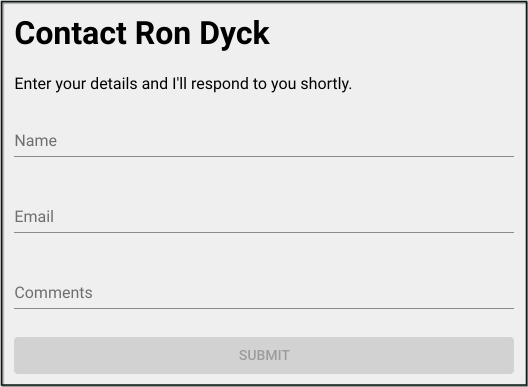

Recently while upgrading my personal site, I decided against using an HTML `mailto` link for sending contact requests. There are a number of reasons why using this method is not a good idea and so I felt it was time to set-up a simple form and a method to process the form fields.

I'm using [Gatsby](https://www.gatsbyjs.org/) as a static site generator which uses [React](https://reactjs.org/) for generating the interface. My stack consists of the following frameworks and libraries:

 - [Gatsby](https://www.gatsbyjs.org/)
 - [React](https://reactjs.org/)
 - [Formik](https://github.com/jaredpalmer/formik)
 - [Material UI](https://material-ui.com/)
 - [Yup](https://github.com/jquense/yup)
 
I've covered Gatsby and React and we'll learn more about Formik, a form builder, Material UI, a React library of components that implement [Google's Material Design](https://material.io/) and lastly Yup, a validation library. I should mention that although I'm using Gatsby with React, much of what I cover in this post can be used for other static site builders -- or any site for that matter.
 
To start with, here is a screenshot of the form:  
  
As you can see, it's fairly basic as we want to keep the process simple for users; avoiding too many fields etc.

While it's possible to do this with one file, I'm going to be using a "container component" to separate the presentation and processing of data giving us a total of 2 files which we'll call `contactForm.js` and `contactForm.cntr.js`.

### The Form Component

Starting with the contactForm.js file, we build our basic form with the following code:

*NOTE: For simplicity sake, I've left out various items like aria attributes and classNames.*

```javascript{numberLines: true}
<form
  autoComplete="off"
  noValidate
  onSubmit={handleSubmit}
>
  <FormControl
    error={!!errors.name}
  >
    <InputLabel htmlFor="name">Name</InputLabel>
    <Input
      autoFocus
      name="name"
      onChange={handleChange}
      value={values.name || ''}
    />
    <FormHelperText id="name-text">{errors.name}</FormHelperText>
  </FormControl>

  <FormControl
    error={!!errors.email}
  >
    <InputLabel htmlFor="email">Email</InputLabel>
    <Input
      name="email"
      onChange={handleChange}
      type="email"
      value={values.email || ''}
    />
    <FormHelperText id="email-text">{errors.email}</FormHelperText>
  </FormControl>

  <FormControl
    error={!!errors.comments}
  >
    <InputLabel htmlFor="comments">Comments</InputLabel>
    <Input
      multiline
      onChange={handleChange}
      value={values.comments || ''}
    />
    <FormHelperText id="comments-text">{errors.comments}</FormHelperText>
  </FormControl>

  <Button
    color="primary"
    disabled={!dirty || isSubmitting}
    type="submit"
    variant="contained"
  >
    Submit
  </Button>
</form>
```

Let's look at each of these components in more detail. Starting with the `form` element we have the `onSubmit` attribute. This simply uses the Formik `handleSubmit` function on submission. You can read more about this handler [here](https://jaredpalmer.com/formik/docs/api/withFormik#handlesubmit-values-values-formikbag-formikbag-void) but essentially it'll be used to pass the form values to a handler method in our container.

Next we have 3 `FormControl` components for each of the fields. These are wrappers that, among other things, aid in displaying errors. These are components of Material UI and you can read about them [here](https://material-ui.com/api/form-control/).

Finally we have the submit button, another Material UI component. I'm disabling the button if the form is not dirty meaning no data has been entered yet, or the form has been submitted. We'll learn more about the `isSubmitting` boolean property a little later.

So now we can move onto the container and how to first validate, then process our form.

### The Form Container

The container handles the form submission and validation. For this we'll use the `withFormk` method:

```javascript{numberLines: true}
const ContactFormCntr = withFormik({
  enableReinitialize: true,
  validateOnChange: false,
  validationSchema: Yup.object().shape({
    name: Yup.string()
      .max(32, 'Maximum number of characters is: 32')
      .required(),
    email: Yup.string()
      .email()
      .required(),
    comments: Yup.string()
      .max(256, 'Maximum number of characters is: 256')
      .nullable(),
  }),
  handleSubmit: async (values, { setStatus, setSubmitting }) => {
    const fields = extractFields(fieldNames, values)
    try {
      await sendEmail(fields)
      setStatus({ success: true })
      setSubmitting(false)
    } catch (err) {
      setStatus({ success: false })
      console.error(err) // eslint-disable-line
    }
  },
  displayName: 'ContactForm',
})

```

Now it's possible that we put this into the same file as the form, but I find this so much cleaner and a better separation of concerns. Read more about the `withFormik` method [here](https://jaredpalmer.com/formik/docs/api/withFormik).

Let's have a look at the [`validationSchema`](https://jaredpalmer.com/formik/docs/api/withFormik#validationschema-schema-props-props-schema) method. Here we're using a [Yup object](https://github.com/jquense/yup#object) to aid in the validation of each of our fields.

