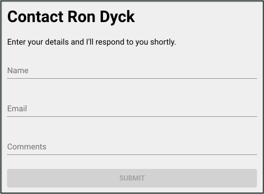

Photo by Jerry Kiesewetter on Unsplash

Recently while upgrading this site, I decided against using an HTML `mailto` link for sending contact requests. There are a number of disadvantages to using this method, and so I felt it was time to set-up a simple contact form and a method to this form.

I'm using [Gatsby](https://www.gatsbyjs.org/) as a static site generator which uses [React](https://reactjs.org/) for generating the interface. My stack consists of the following frameworks and libraries:

 - [AWS SES](https://aws.amazon.com/ses)
 - [Gatsby](https://www.gatsbyjs.org/)
 - [React](https://reactjs.org/)
 - [Formik](https://github.com/jaredpalmer/formik)
 - [Material UI](https://material-ui.com/)
 - [Yup](https://github.com/jquense/yup)

## AWS Services

The basis for this tutorial is the AWS Simple Email [(SES)](https://aws.amazon.com/ses) Service. If you're following along you'll need an AWS account. Then head on over to the AWS console and setup an email address with the SES service. The process is fairly simple and requires you to validate an email address that you plan on using as the recipient. The cost of the service won't be a factor until you're sending a large number of emails, the AWS docs state: *"$0 for the first 62,000 emails you send each month, and $0.10 for every 1,000 emails you send after that."*

Before we can use the [Javascript SDK](https://docs.aws.amazon.com/AWSJavaScriptSDK/latest/) to send our emails, we need to have authorization from AWS and for that we'll be using [AWS Cognito](https://aws.amazon.com/cognito).

### Cognito Identity Pool
To allow the SES service to send emails from your site you'll need to first setup a Cognito Identity Pool. The process may seem a little intimidating if you've never worked with [IAM](https://aws.amazon.com/iam) but no worries, we'll step through this no sweat.

From the [AWS SDK for Javascript getting started guide](https://docs.aws.amazon.com/sdk-for-javascript/v2/developer-guide/getting-started-browser.html) we get the following steps:  
*Note: I've made some minor changes to accommodate SES*

>**Step 1: Create an Amazon Cognito Identity Pool**

>In this exercise, you create and use an Amazon Cognito identity pool to provide unauthenticated access to your browser script for the Amazon SES service. Creating an identity pool also creates two IAM roles, one to support users authenticated by an identity provider and the other to support unauthenticated guest users.

>In this exercise, we will only work with the unauthenticated user role to keep the task focused. You can integrate support for an identity provider and authenticated users later.

>To create an Amazon Cognito identity pool

>1. Sign in to the AWS Management Console and open the Amazon Cognito console at https://console.aws.amazon.com/cognito/.
>1. Choose **Manage Identity Pools** on the console opening page.
>1. On the next page, choose **Create new identity pool**.
>1. In the **Getting started wizard**, type a name for your identity pool in **Identity pool name**.
>1. Choose **Enable access to unauthenticated identities**.
>1. Choose **Create Pool**.
>1. On the next page, choose **View Details** to see the names of the two IAM roles created for your identity pool. Make a note of the name of the role for unauthenticated identities. You need this name to add the required policy for Amazon SES.
>1. Choose **Allow**.
>1. On the **Sample code** page, copy or write down the identity pool ID displayed in red. You need this value for your browser script.

>After you create your Amazon Cognito identity pool, you're ready to add permissions for Amazon SES that are needed by your browser script.

>**Step 2: Add a Policy to the Created IAM Role**

>To enable browser script access to Amazon SES, use the unauthenticated IAM role created for your Amazon Cognito identity pool. This requires you to add an IAM policy to the role. For more information on IAM roles, see [Creating a Role to Delegate Permissions to an AWS Service](https://docs.aws.amazon.com/IAM/latest/UserGuide/id_roles_create_for-service.html) in the IAM User Guide.

>**To add an Amazon SES policy to the IAM role associated with unauthenticated users**

>1. Sign in to the AWS Management Console and open the IAM console at [https://console.aws.amazon.com/iam/](https://console.aws.amazon.com/iam/).
>1. In the navigation panel on the left of the page, choose **Roles**.
>1. In the list of IAM roles, choose the unauthenticated identities role previously created by Amazon Cognito.
>1. In the **Summary** page for this role, choose **Attach policies**.
>1. In the **Attach Permissions** page for this role, find and then choose **AmazonSESFullAccess**.
>1. Choose **Attach policy**.

>NOTE: The AmazonSESFullAccess role is a little "looser" than I would normally recommend, but you can always refine it later.

Great, with that out of the way we can focus on the form.

## The Contact Form

As mentioned I'm using Gatsby with React as the static site generator. Using React provides us with a lot of options for building our form. I've been using [Formik](https://jaredpalmer.com/formik) lately and found it to be pretty awesome. You don't need to use [Redux](https://redux.js.org/) or another state management library and it is both easy to use and feature rich. For styling I use [Material UI](https://material-ui.com/) which is a React library of components that implement [Google's Material Design](https://material.io/). Lastly for validation [Formik](https://jaredpalmer.com/formik) works well with [Yup](https://github.com/jquense/yup), a validation library that we will learn more about shortly.

I should mention that although I'm using Gatsby with React, much of what I cover in this post can be used for other static site builders -- or any site for that matter.
 
To start with, here is a screenshot of the form:

  
As you can see, it's fairly basic as we want to keep the process simple for our users and avoid any unnecessary fields.

While it's possible to do the form and contact page in one file, we're going to be using a **container component** to separate the presentation and processing of data, giving us 2 files which we'll call `contactForm.js` and `contactForm.cntr.js`.

### The Form Component

Starting with the `contactForm.js` file, we build our basic form with the following code:  
*NOTE: For simplicity sake, I've left out various items like aria attributes and classNames.*

```javascript{numberLines: true}
<form
  autoComplete="off"
  noValidate
  onSubmit={handleSubmit}
>
  <FormControl
    error={!!errors.name}
  >
    <InputLabel htmlFor="name">Name</InputLabel>
    <Input
      autoFocus
      name="name"
      onChange={handleChange}
      value={values.name || ''}
    />
    <FormHelperText id="name-text">{errors.name}</FormHelperText>
  </FormControl>

  <FormControl
    error={!!errors.email}
  >
    <InputLabel htmlFor="email">Email</InputLabel>
    <Input
      name="email"
      onChange={handleChange}
      type="email"
      value={values.email || ''}
    />
    <FormHelperText id="email-text">{errors.email}</FormHelperText>
  </FormControl>

  <FormControl
    error={!!errors.comments}
  >
    <InputLabel htmlFor="comments">Comments</InputLabel>
    <Input
      multiline
      onChange={handleChange}
      value={values.comments || ''}
    />
    <FormHelperText id="comments-text">{errors.comments}</FormHelperText>
  </FormControl>

  <Button
    color="primary"
    disabled={!dirty || isSubmitting}
    type="submit"
    variant="contained"
  >
    Submit
  </Button>
</form>
```
You can view the full contents of the `contactForm.js` file [here](https://github.com/pulpfree/rondyck/blob/master/src/components/ContactForm.js)

Let's look at each of these components in more detail. Starting with the `form` element we have the `onSubmit` attribute. This simply uses the Formik `handleSubmit` method on submission. You can read more about this method [here](https://jaredpalmer.com/formik/docs/api/withFormik#handlesubmit-values-values-formikbag-formikbag-void), but essentially it's purpose is to pass the form values to a method in our container.

Next we have 3 `FormControl` components, one for each of our fields. These are wrappers that, among other things, aid in displaying errors. These are components of Material UI and you can read more about them [here](https://material-ui.com/api/form-control/).

Finally we have a submit button: `<Button>`, another [Material UI component](https://material-ui.com/demos/buttons/). I'm disabling the button if the form is not dirty, meaning no data has been entered yet, or the form has been submitted: `isSubmitting`. We'll see more of the `isSubmitting` boolean property a little later.

So now we can move onto the container and discover how to validate and send our email.

### The Form Container

As mentioned, our container file handles the form submission, validation and processing. We'll be using the Formik `withFormk` method which creates a higher-order React component (HOC).

```javascript{numberLines: true}
const ContactFormCntr = withFormik({
  enableReinitialize: true,
  validateOnChange: false,
  validationSchema: Yup.object().shape({
    name: Yup.string()
      .max(32, 'Maximum number of characters is: 32')
      .required(),
    email: Yup.string()
      .email()
      .required(),
    comments: Yup.string()
      .max(256, 'Maximum number of characters is: 256'),
  }),
  handleSubmit: async (values, { setStatus, setSubmitting }) => {
    const fields = extractFields(fieldNames, values)
    try {
      await sendEmail(fields)
      setStatus({ success: true })
      setSubmitting(false)
    } catch (err) {
      setStatus({ success: false })
      console.error(err) // eslint-disable-line
    }
  },
  displayName: 'ContactForm',
})

```
You can view the full contents of the `contactForm.cntr.js` file [here](https://github.com/pulpfree/rondyck/blob/master/src/pages/contact.js)

Formik provides several options in regards to processing the form, but I find creating an HOC so much cleaner and provides a better separation of concerns. You can read more about the `withFormik` method [here](https://jaredpalmer.com/formik/docs/api/withFormik).

### Field Validation
Let's have a look at line #4, the [`validationSchema`](https://jaredpalmer.com/formik/docs/api/withFormik#validationschema-schema-props-props-schema) method. Here we're using a [Yup object](https://github.com/jquense/yup#object) to define a schema to define the validation steps for each of our fields. The first field: `name`, must be a string with a maximum of 32 characters and is required. Next is the `email` field which is also a string, must be a valid email address and is required. Finally the comments field, which is a string with a maximum of 256 characters and is not required.

On line #3 you'll notice that I've set the `validateOnChange` property to false. The default value for this is true which causes Formik to validate all fields after each keystroke. The problem arrises when we have required fields and in our case when entering info, the `email` field displays a "required field" error when we enter data into the `name` field. I found this rather annoying and the fix was to set the `validateOnChange` property to false so that fields are validated `onBlur` (or when leaving the field).

### Form Processing
Next on line #14 we have the `handleSubmit` method. This method is passed all of our forms' `values` as well as the "FormikBag", check the [Formik docs](https://jaredpalmer.com/formik/docs/api/withFormik#handlesubmit-values-values-formikbag-formikbag-void) for more details on this. Notice that I'm returning a promise (via async/await) and using try/catch to handle any errors in our `handleSubmit` method. The `values` argument that is passed into the `handleSubmit` method includes a number of our form component properties that aren't required and so on line #16 I'm extracting just our form fields with a function named: `extractFields`.

```javascript{numberLines: true}
const fieldNames = ['email', 'name', 'comments']

function extractFields(names, values) {
  const fields = {}
  names.forEach((nm) => {
    if (nm in values) {
      fields[nm] = values[nm]
    }
  })
  return fields
}
```

While this isn't entirely necessary, it ensures that our next function: `sendEmail` receives only the relevant field values. `sendEmail` is the heart of our processing phase and is exported from our AWS SES service file which you can view in entirety [here](https://github.com/pulpfree/rondyck/blob/master/src/utils/SESService.js). Let's have a look at this function now:

```javascript{numberLines: true}
export default async function sendEmail(fields) {
  const svc = new AWS.SES({ apiVersion: '2010-12-01' })
  let body = `From: ${fields.name} <${fields.email}>\n\n`
  body += `Message:\n${fields.comments}`
  params.Message.Body.Text.Data = body

  await svc.sendEmail(params).promise()
    .catch((err) => {
      console.error(err, err.stack)
    })
}
```

The `fields` argument that we passed into the function earlier, is now used to build the body of the email. On line #2 we instantiate the [AWS SES class](https://docs.aws.amazon.com/AWSJavaScriptSDK/latest/AWS/SES.html) and store it in the `svc` variable. Next we build up the body of our email in our `body` variable. I'm sending the emails in a plain text format (opposed to HTML), but with a little effort we could also send HTML emails. See the [SES Docs](https://docs.aws.amazon.com/AWSJavaScriptSDK/latest/AWS/SES.html#sendEmail-property) for details on this.

On line #5 I'm setting the body of the email, and then on line #7 I'm using the SES service `sendMail` method (which, yes is the same name as our exported method), to do the actual send. This method returns the id of the message sent, but I see no need to capture this value and am only concerned with catching errors.

Now back to our Form Container and the `handleSubmit` method. On line #18 we use the Formik `setStatus` method to set a `success` boolean variable to true. In the form component we use this to display a success message letting the user know the form is being sent. The next line, #19 sets the Formik `isSubmitting` flag to false. Truthfully we really don't need this as the form is no longer displayed after the `success` flag is set to true, but I've left it here to show how the `isSubmitting` flag is set. This is a handy feature that I like to use on more complex forms. Should we receive an error from our `sendMail` method, it is caught on line #20 and the `success` flag is set to false and we send the `err` to the console. Finally on line #25 is the `displayName` property which you can read about [here](https://jaredpalmer.com/formik/docs/api/withFormik#displayname-string)

## Testing
If you have a look at the [SESService file](https://github.com/pulpfree/rondyck/blob/master/src/utils/SESService.js) you can see how the `params` object is populated with the Destination email, Subject etc. values. Although a proper integration test should be written to ensure that all values are setup properly and all permissions for IAM are accurate, for simplicity sake we're just going to do "quick and dirty" test. If you are using Gatsby then you can fire up your environment with `gatsby develop` and fill-in and submit the form. If you're getting errors start with checking the [SES Docs](https://docs.aws.amazon.com/AWSJavaScriptSDK/latest/AWS/SES.html#sendEmail-property) where you'll find an example that shows the required fields etc.

The only other source of problems you might encounter are IAM restrictions. Providing you follow the instruction from AWS, you should be good, double check that you have the correct role etc. and try again.

## Summary
If you've come this far you've likely surmised that the actual sending of an email using AWS SES from a static site is really quite simple. This tutorial also included form creation and processing with Formik as well as a simple introduction to Yup. With these tools you have what it takes to build larger and more complex forms without building an API back-end or subscribing to a third party service to handle form submissions.

Thanks for reading, and I would love to get your feedback. If you have any questions or corrections, please feel free to comment below.


